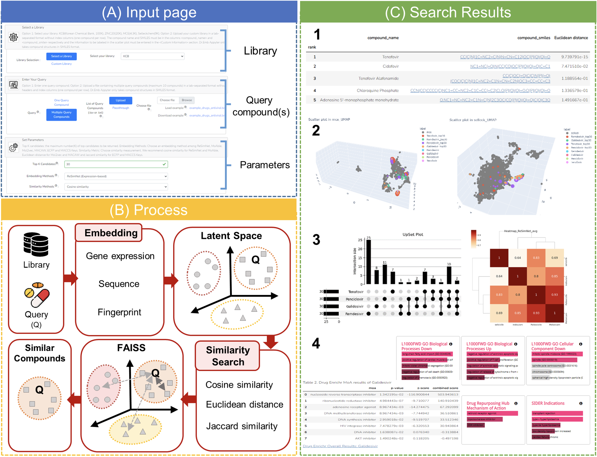
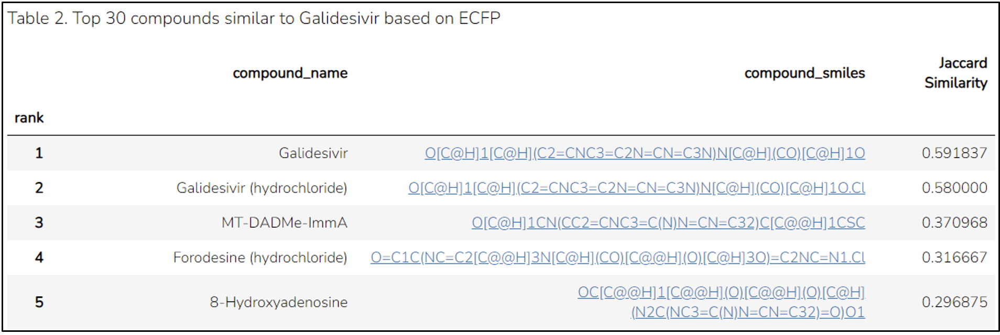
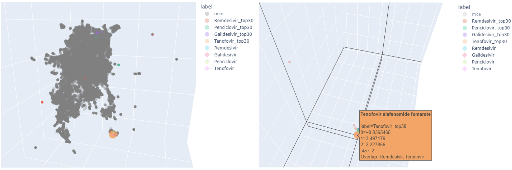
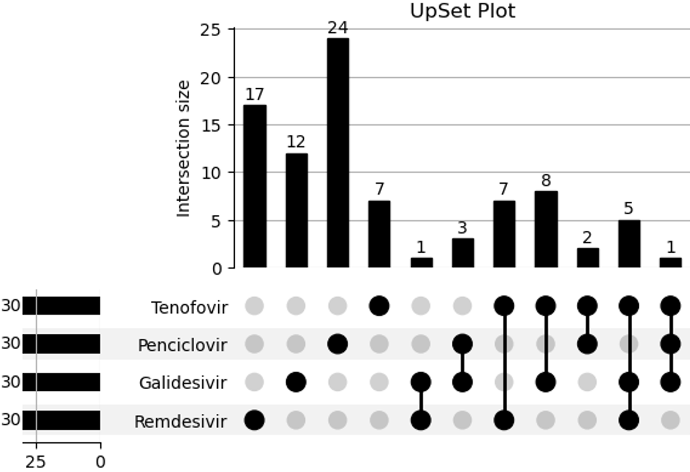
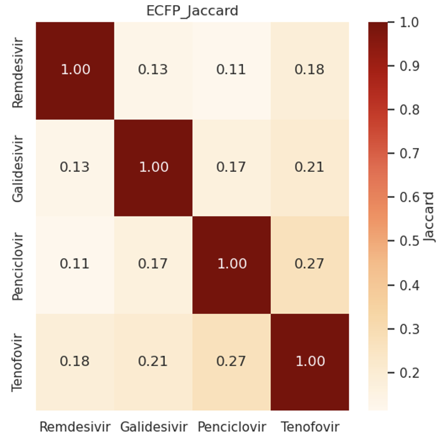
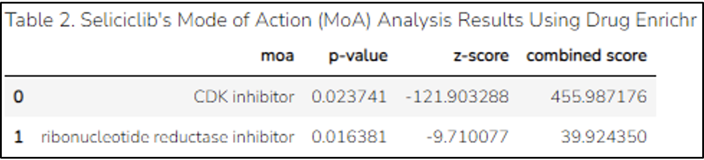
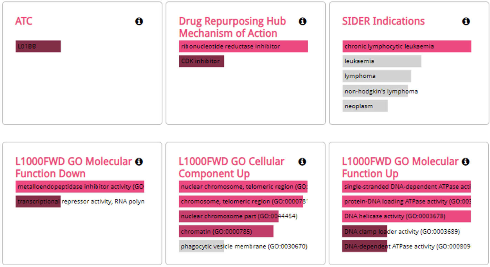

# Dr.Emb Appyter: A Web Platform for Drug Discovery using Embedding Vectors

Dr.Emb Appyter is a web platform which searches closely located compounds of query compounds in the embedding space for drug discovery. 
We provide the <a href="https://drive.google.com/file/d/1_ljSSSSlcQ5HTlpctqH2Ks_WWTus-93v/view?usp=sharing" target="_blank" rel="noopener noreferrer">user guide</a> for those who experience challenges when navigating Dr.Emb Appyter.



## Abstract

<p> Numerous in silico approaches have been proposed to reduce the time and cost of drug discovery. One of the most important processes in in silico approaches is the employment of embedding methods to properly map the properties of chemical compounds into a latent space. Using the embedding methods, compounds with similar properties will be closely located in the space, and these embedding vectors can be used to find other compounds with the desired properties based on the distance between compounds and as input for other downstream tasks, such as drug-target interaction prediction. However, they often require substantial computational resources and programming skills, so it is challenging for biologists and medicinal chemists to apply in silico methods in their research. Therefore, it is necessary to develop a user-friendly platform on which users can search for chemical compounds based on embedding vectors without any technical barriers.</p>
<p> We proposed Dr.Emb Appyter, a user-friendly web platform for drug discovery. It uses embedding vectors to identify compounds similar to a given query in the embedding space. Dr.Emb Appyter provides various types of embedding methods, such as fingerprinting, SMILES, and transcriptional response-based methods, and embeds numerous compounds using them. The Faiss-based search system efficiently finds the closest compounds of query compounds in the library. Additionally, Dr.Emb Appyter offers information on the top compounds; visualizes the results with 3D scatter plots, heatmaps, and UpSet plots; and analyzes the results using a drug-set enrichment analysis. Dr.Emb Appyter is freely available at https://dremb.korea.ac.kr. </p>

------------

# File Information

## Example input files

We provide two example input files, antiviral_drugs.txt for multiple query compounds and custom_library.tsv for custom library. <br>

1. static/antiviral_drugs.txt: Information on four antiviral drugs, including their names and smiles. <br>
2. static/custom_library.tsv: A library containing about 700 compounds, with mechanism of action (MoA) information indicated in 'Description' column. <br>

## List of files to download

1. [Embedding vetors of Default Libraries](https://docs.google.com/uc?export=download&id=1bZpepqycN9LPPLXDqX8georOCYsAj_zD&confirm=t) (3GB): The embedding vectors file has been generated by embedding compounds registered in the Korea Chemical Bank (KCB), ZINC20, MedChemExpress (MCE), and Selleckchem libraries. Once decompressed, they amount to approximately 8GB.

2. [Embedding Models](https://docs.google.com/uc?export=download&id=1UUukbVN6r5XIyL6bAIMKYOZ4igldIp8M&confirm=t) (10GB): The embedding methods (models) file includes ReSimNet, MoAble, Mol2vec, MACAW, and UMAP. Once decompressed, they amount to approximately 14GB.

PubChem/ChEMBL library and embedding vectors file are huge. Please contact the author to use them.

------------

# Simple Results

## Table with Top k Candidates

The top k compounds are retrieved from the library and ranked based on the highest similarity. The names and SMILES of the compounds in the library are displayed in the 'compound_name' and 'compound_smiles' columns, respectively. Additionally, the SMILES information is interactive, with clickable links redirecting to PubChem. <br>


## Scatter Plot

A scatter plot by UMAP visualizes all the compounds in the library (denoted as L, in gray, with a circle shape), along with the query compounds (Q, diamond) and the top k compounds (Q_topk, circle) in the embedding space. <br>


## UpSet Plot

Dr.Emb Appyter visualizes overlapping compounds graphically. An Upset plot illustrates any overlapping compounds found for each query compound. <br>


## Heatmap

Dr.Emb Appyter shows similarities between user-queried compounds. The heatmap visualizes the similarity between the embedding vectors of the query compounds entered by the user, facilitating an assessment of the likelihood that the query compounds share similar properties. <br>


## Drug-Set Enrichment Analysis (Drug Enrichr)

Drug Enrichr is a tool that performs drug set enrichment analysis (DSEA) in terms of targets, mode of actions, side effects, pathways or ontologies. Dr.Emb Appyter performs DSEA by entering the names of the top k compounds into Drug Enrichr. <br>


To explore additional drug set results, please click the link provided below in Dr.Emb Appyter. <br>


------------

# Start Dr.Emb Appyter

## Common Preparation

```{bash}
git clone https://github.com/KU-MedAI/The-Dr.Emb-Appyter.git
cd The-Dr.Emb-Appyter
```

In the case of Embedding vetors of Default Libraries file, the file size is about 10GB, which can result in a long download time.

```{bash}
# File 1 Download
wget --load-cookies /tmp/cookies.txt "https://docs.google.com/uc?export=download&confirm=$(wget --quiet --save-cookies /tmp/cookies.txt --keep-session-cookies --no-check-certificate 'https://docs.google.com/uc?export=download&id=1bZpepqycN9LPPLXDqX8georOCYsAj_zD' -O- | sed -rn 's/.*confirm=([0-9A-Za-z_]+).*/\1\n/p')&id=1bZpepqycN9LPPLXDqX8georOCYsAj_zD" -O Library.zip && rm -rf /tmp/cookies.txt && unzip Library.zip && rm -r Library.zip

# File 2 Download
wget --load-cookies /tmp/cookies.txt "https://docs.google.com/uc?export=download&confirm=$(wget --quiet --save-cookies /tmp/cookies.txt --keep-session-cookies --no-check-certificate 'https://docs.google.com/uc?export=download&id=1UUukbVN6r5XIyL6bAIMKYOZ4igldIp8M' -O- | sed -rn 's/.*confirm=([0-9A-Za-z_]+).*/\1\n/p')&id=1UUukbVN6r5XIyL6bAIMKYOZ4igldIp8M" -O Library.zip && rm -rf /tmp/cookies.txt && unzip methods.zip && rm -r methods.zip
```

## Local

    pip install --no-cache-dir -r requirements.txt

When running on a local computer, use the file `dr_emb.ipynb`. To view a simplified version of the execution results without the code, use the `--extras` option.

```{bash}
appyter dr_emb.ipynb --extras=toggle-code --extras=toc --extras=hide-code
```

## Docker

    docker build -t dremb:1.0 .
    docker run --privileged --name dremb dremb:1.0

When running on Docker, use the file `dr_emb_docker.ipynb`. To view a simplified version of the execution results without the code, use the `--extras` option.

```{bash}
appyter dr_emb_docker.ipynb --extras=toggle-code --extras=toc --extras=hide-code
```

------------

# Acknowledgement

The chemical library used in this study was kindly provided by Korea Chemical Bank (http://www.chemicalbank.org/) of Korea Research Institute of Chemical Technology, Sellckchem (https://www.selleckchem.com/) of Selleck Chemicals LLC, and MCE (https://www.medchemexpress.com/) of MedChemExpress LLC.
This work was supported by the National Research Foundation of Korea Grant funded by the Korean Government (NRF-2022R1F1A1070111) and the MSIT(Ministry of Science and ICT), Korea, under the ICAN (ICT Challenge and Advanced Network of HRD) program(IITP-2023-RS-2022-00156439) supervised by the IITP (Institute of Information & Communications Technology Planning & Evaluation).